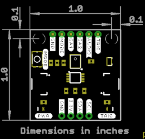

# Qwiic Sound Trigger

A sound trigger which you can use on its own, or as part of your Qwiic system.

[Qwiic Sound Trigger (SPX-17979)](https://www.sparkfun.com/products/17979)

The Qwiic Sound Trigger is based on the VM1010 from Vesper Technologies and the TI PCA9536 GPIO expander.

The VM1010 is a clever little device which can be placed into a very low power "Wake On Sound" mode. When it detects a sound,
it wakes up and pulls its TRIG (DOUT) pin high. The VM1010 can then be placed into "Normal" mode by pulling the
MODE pin low; it then functions as a regular microphone. The analog microphone signal is available on the AUDIO (VOUT) pin.
All of this happens really quickly, within 50 _microseconds_ (_much_ faster than a capacitive MEMS microphone), so you don't miss
the start of the audio signal.

The noise threshold required to wake the VM1010 can be programmed via the resistance between pins GA1 and GA2. By default, the 20K
resistor on the breakout sets the noise threshold to close to the minimum (most sensitive) setting. You can increase the threshold
to maximum (least sensitive) by cutting the THRESH jumper. You can set it mid-way by adding your own resistor between breakout pins GA1 and GA2.

If you are using the VM1010 purely as a sound trigger, you need to reset it after each event by: pushing the MODE button;
pulling the MODE breakout pin low; or using the Qwiic bus to instruct the PCA9536 to pull the MODE signal low (the VM1010 MODE signal is connected to GPIO0).

You can use the TRIG (DOUT) breakout pin to generate an interrupt on your microcontroller. Or you can read (poll) its state via
the PCA9536 (the TRIG (DOUT) signal is connected to GPIO1).

There are two LEDs: one to indicate if the breakout is powered; and a second to show when a sound trigger has taken place. You can disable
either or both LEDs by cutting the LED jumpers on the back of the breakout.

As usual, the breakout includes I2C pull-up resistors. You can disable those if you need to by cutting the I2C jumpers.

The [**/Examples**](./Examples) folder contains two example sketches for the Arduino IDE:
- Example1 is a very simple example showing how to read the sound trigger TRIG signal via the PCA9536 GPIO1 pin and reset it via the MODE signal and GPIO2
- Example2 is a more complex example showing how you can capture and log the rising edge of the sound event with _nanosecond_ resolution using a ZED-F9P GNSS receiver

The [**/Utils**](./Utils) folder contains Python tools which can process the UBX TIM_TM2 data logged by Example2 and calculate the location of the sound events.

## Repository Contents
- [**/Examples**](./Examples) - Example sketches (.ino). Run these from the Arduino IDE
- [**/Utils**](./Utils) - Python tools to process the UBX TIM_TM2 data logged by Example2
- [**/Documents**](./Documents) - Datasheets etc. for both the VM1010 and PCA9536
- [**/Hardware**](./Hardware) - Eagle schematic and PCB design files
- [**LICENSE.md**](./LICENSE.md) contains the licence information

## Library

- **[SparkFun PCA9536 Arduino Library](https://github.com/sparkfun/SparkFun_PCA9536_Arduino_Library)** - Library for the TI PCA9536 4-Bit GPIO Expander

**_Your friends at SparkFun_**
